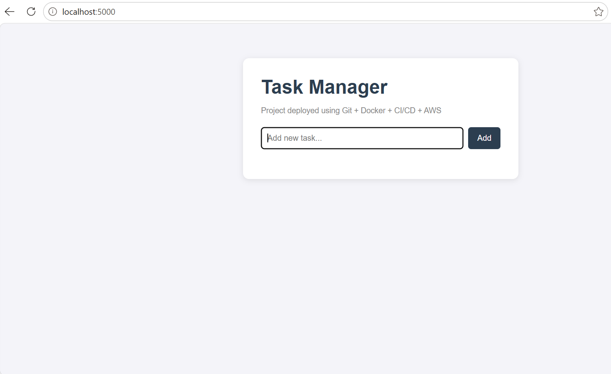
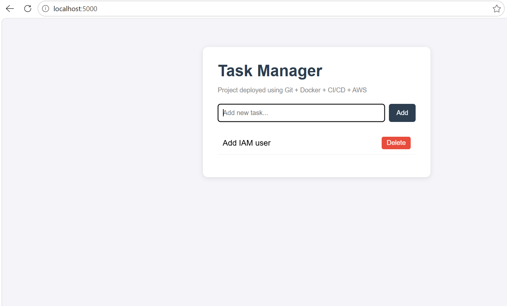

# Task Manager - Deployed on AWS (Docker + ECS Fargate + CI/CD)

A simple full-stack task manager application, built to practice and demonstrate
end-to-end DevOps workflow: from local development to a production-style
deployment on AWS.

## What this project does

- Add, complete, and delete tasks from a simple web interface
- Backend is a REST API built with Python (Flask)
- Frontend is plain HTML, CSS, and JavaScript (fetch API)
- Packaged with Docker and deployed on AWS ECS Fargate behind a Load Balancer

## Tech Stack

| Layer | Technology |
|---|---|
| Frontend | HTML, CSS, JavaScript |
| Backend | Python (Flask) |
| Containerization | Docker |
| CI/CD | GitHub Actions |
| Image Registry | Amazon ECR |
| Hosting | AWS ECS Fargate |
| Load Balancing | AWS Application Load Balancer (ALB) |

## Architecture

```
Developer pushes code to GitHub
        |
GitHub Actions (CI/CD pipeline runs automatically)
        |
   Build Docker image --> Push to Amazon ECR
        |
AWS ECS Fargate pulls the image and runs containers
        |
Application Load Balancer distributes traffic to containers
        |
      End user (browser)
```

## Screenshots




## How to run this locally

```bash
git clone https://github.com/<your-username>/task-manager-aws-devops.git
cd task-manager-aws-devops
docker build -t task-manager .
docker run -d -p 5000:5000 --name taskapp task-manager
```

Open `http://localhost:5000` in your browser.

## How it is deployed on AWS

1. Code is pushed to GitHub
2. A GitHub Actions pipeline automatically builds the Docker image
3. The image is pushed to Amazon ECR (AWS's private container registry)
4. AWS ECS Fargate runs the container without needing to manage any server (EC2)
5. An Application Load Balancer sits in front of the containers and handles
   incoming traffic, along with basic health checks

## What I learned building this

- Setting up Git version control and resolving merge conflicts
- Writing a Dockerfile and understanding image vs container
- Debugging container issues using `docker logs` and `docker exec`
- Writing a CI/CD pipeline using GitHub Actions and YAML
- Using GitHub Secrets to avoid hardcoding credentials
- Designing a basic cloud architecture: ECR, ECS Fargate, ALB, Security Groups

## Author

Naman Rathore
